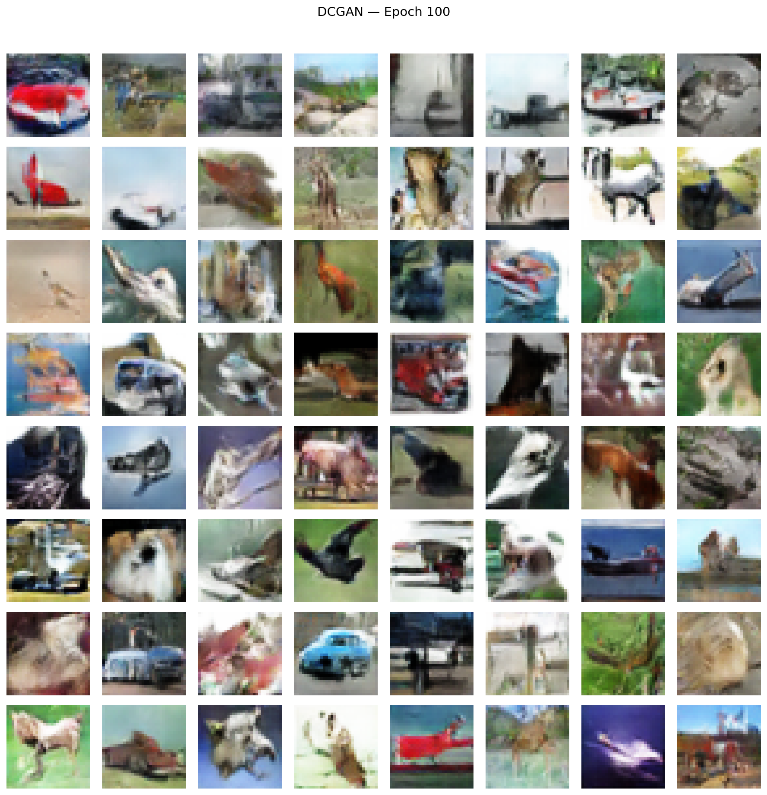
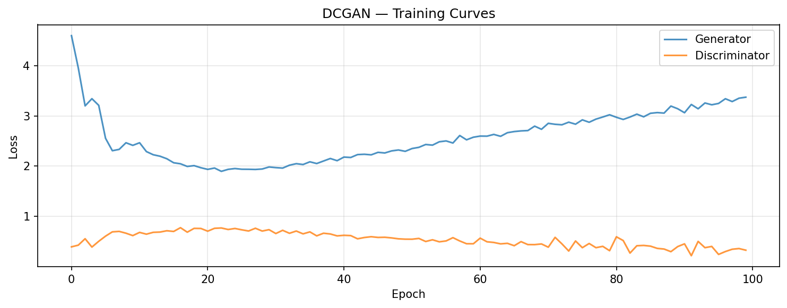

# GANs — TensorFlow Pipeline

Streamlined TensorFlow GAN implementation on CIFAR-10, focusing on DCGAN — the best-performing variant from PyTorch's 4-variant exploration. Runs on WSL2 GPU (RTX 4090) since conv training on 50K images is impractical on CPU (crashed the Windows kernel). WGAN-GP was skipped — PT showed it scores worse FID (55 vs 31) at 100 epochs, and TF's 15x training overhead made the 6+ hour estimate unjustifiable.

## Overview

- **1 variant**: DCGAN only (PT covered Vanilla → DCGAN → WGAN-GP → cGAN progression)
- **Dataset**: CIFAR-10 (50K train, 32x32 RGB) — same preprocessed data as PyTorch, [-1, 1] normalization
- **Key TF showcase**: Keras Sequential + `tf.GradientTape` custom training loop
- WSL2 GPU (RTX 4090) — TF on Windows has no GPU support

## What Runs on GPU

| Component | Device | Why |
|-----------|--------|-----|
| DCGAN training | WSL2 GPU (RTX 4090) | Conv layers on 50K images — CPU crashed |
| FID computation | Skipped | `compute_fid` uses PT InceptionV3, CPU-only in WSL2 TF venv |
| All inference | WSL2 GPU | Generator forward pass |

---

## Dataset

| Property | Value |
|----------|-------|
| Name | CIFAR-10 |
| Source | `tensorflow.keras.datasets.cifar10` |
| Train | 50,000 images |
| Test | 10,000 images |
| Shape | 32x32x3 RGB |
| Classes | 10 (airplane, automobile, bird, cat, deer, dog, frog, horse, ship, truck) |
| Balance | Perfect (5,000 per class) |
| Normalization | [-1, 1] via `pixel / 127.5 - 1.0` (tanh generator output) |

---

## DCGAN Architecture

```
Generator:  Dense(256*4*4) → Reshape(4,4,256) → ConvT(128,8x8) → ConvT(64,16x16) → ConvT(3,32x32) + Tanh
Discriminator: Conv(64,16x16) → Conv(128,8x8) → Conv(256,4x4) → Flatten → Dense(1) (logit)
G params: 1,069,824 | D params: 664,129
Training: BCE (from_logits=True), Adam(lr=0.0002, betas=[0.5, 0.999]), weight init N(0, 0.02), 100 epochs
```

**TF-specific differences from PT:**
- `Dense` + `Reshape` replaces PT's `ConvTranspose2d(z, 256, 4, 1, 0)` — Keras Sequential doesn't support 4D input directly
- `from_logits=True` in BCE — D outputs raw logits, no sigmoid layer
- `@tf.function` compiled training step for graph-mode optimization
- Channel-last format `(N, 32, 32, 3)` throughout — no transpose needed

**Result**: Recognizable objects (vehicles, animals, backgrounds). Training curves show same D-winning pattern as PT (D: 0.33, G: 3.37 at epoch 100). Quality visually comparable to PT DCGAN.

### Generated Samples



### Training Curves



---

## Performance Benchmarks

| Metric | TensorFlow | PyTorch |
|--------|-----------|---------|
| FID | N/A | 30.57 |
| Training Time | 4,738s (79.0 min) | 319s (5.3 min) |
| Per-Epoch Time | 47.38s | 3.19s |
| Inference Speed | 43.39 us/sample | 6.01 us/sample |
| GPU Memory Peak | 1,078 MB | 345 MB |
| Generator Size | 4,176 KB (1.07M params) | 4,176 KB (1.07M params) |

### Why TF Is 15x Slower

The training time gap (79 min vs 5.3 min) is primarily due to WSL2's `/mnt/c/` filesystem overhead. The data lives on the Windows filesystem, and every batch read goes through the 9P protocol translation layer. This is a known WSL2 bottleneck — not a fundamental TF vs PT performance difference. Moving data to the Linux filesystem (`~/data/`) would likely close much of this gap.

---

## Variants Skipped (and Why)

| Variant | PT FID | Why Skipped |
|---------|--------|-------------|
| Vanilla GAN | 261.47 | PT already demonstrated why MLPs fail for images |
| WGAN-GP | 55.35 | Worse FID than DCGAN at 100 epochs, estimated 6h+ on TF WSL2 |
| Conditional GAN | 147.90 | PT covered class-conditional generation |

**Rationale**: PT pipeline was the exploration phase (4 variants, progressive build). TF pipeline is the comparison phase — reproduce the best variant (DCGAN) and compare framework ergonomics.

---

## Key Insights

1. **`tf.GradientTape` is essential for GANs** — Keras `model.fit()` cannot alternate Generator/Discriminator updates within a batch. Custom training loops are non-negotiable for adversarial training.

2. **WSL2 filesystem is the real bottleneck** — 15x slower training is dominated by I/O, not compute. The GPU itself is the same RTX 4090.

3. **Architecture parity confirmed** — Generator size matches exactly (4,176 KB). The 896-param difference (1,069,824 vs 1,068,928) comes from Dense+Reshape vs ConvTranspose2d for the initial projection layer.

4. **TF eager mode + @tf.function** — Graph compilation via `@tf.function` is critical for performance. Without it, training would be even slower on WSL2.

## TensorFlow Features Used

| Feature | Purpose |
|---------|---------|
| `keras.layers.Conv2DTranspose` | Generator upsampling |
| `keras.layers.Conv2D` with strides | Discriminator downsampling |
| `keras.layers.BatchNormalization` | Training stabilization |
| `tf.GradientTape` | Manual gradient computation for adversarial training |
| `tf.function` | Graph-mode compilation for training step |
| `keras.losses.BinaryCrossentropy` | Adversarial loss (from_logits=True) |
| `keras.optimizers.Adam` | Adaptive optimizer with DCGAN betas |
| `tf.data.Dataset` | Batched shuffled training with prefetch |
| WSL2 GPU | RTX 4090 via Ubuntu (TF has no Windows GPU) |

## Files

```
TensorFlow/14-gans/
├── pipeline.ipynb                          # Full pipeline (6 cells)
├── README.md                               # This file
├── requirements.txt                        # Verified package versions
└── results/
    ├── dcgan_generator.weights.h5          # Generator weights (Keras format)
    ├── dcgan_discriminator.weights.h5      # Discriminator weights
    ├── dcgan_history.npz                   # G/D loss arrays
    ├── metrics.json                        # Benchmark metrics
    ├── dcgan_samples.png                   # Generated image grid
    ├── dcgan_curves.png                    # Training curves
    └── dcgan_eval_grid.png                 # Evaluation sample grid
```

## How to Run

```bash
# Requires WSL2 with NVIDIA GPU support
wsl
source ~/tf-gpu-venv/bin/activate

# Navigate to project
cd /mnt/c/Users/Max/Desktop/Coding/.Projects/2026/ml-framework-comparisons

# Run preprocessing first (if not already done)
python data-preperation/preprocess_gans.py

# Launch Jupyter and open TensorFlow/14-gans/pipeline.ipynb
jupyter notebook
# ~80 minutes total on WSL2 GPU (RTX 4090)
```
