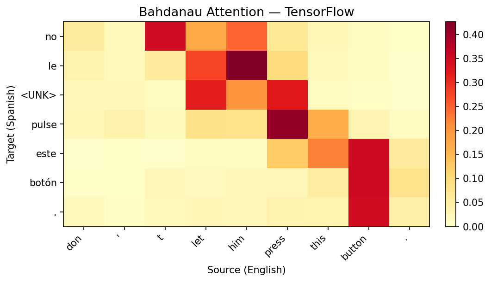

# Attention Mechanisms — TensorFlow Pipeline

Streamlined TensorFlow Bahdanau attention implementation on Tatoeba EN→ES, confirming PyTorch's best-performing variant. Runs on WSL2 GPU (RTX 4090) since seq2seq training on 114K sentence pairs with per-step decoding is impractical on CPU. Achieves BLEU 0.3368 — 12% below PyTorch's 0.3803, explained by the `reset_after=False` GRU kernel workaround required for WSL2 cuDNN compatibility.

## Overview

- **1 variant**: Bahdanau (additive) only — PT covered No-Attention → Bahdanau → Luong → Multi-Head progression
- **Dataset**: Tatoeba EN→ES (114K train / 14K val / 14K test) — same preprocessed data as PyTorch
- **Key TF showcase**: Keras subclassed models + `tf.GradientTape` custom training loop + `tf.cond` graph-safe teacher forcing
- WSL2 GPU (RTX 4090) — TF on Windows has no GPU support

## What Runs on GPU

| Component | Device | Why |
|-----------|--------|-----|
| Bahdanau training | WSL2 GPU (RTX 4090) | Encoder-decoder with attention over 114K sentence pairs |
| All inference/decoding | WSL2 GPU | Greedy decode with attention computation |
| BLEU evaluation | GPU + CPU | GPU for decoding, CPU for nltk BLEU scoring |

---

## Dataset

| Property | Value |
|----------|-------|
| Name | Tatoeba EN→ES |
| Source | `spa.txt` (Tab-separated EN/ES pairs) |
| Train | 114,478 pairs |
| Val | 14,309 pairs |
| Test | 14,311 pairs |
| EN Vocab | 10,004 |
| ES Vocab | 10,004 |
| Max Length | 20 tokens |
| Tokenization | Word-level, preserving Spanish accented characters |
| Special Tokens | PAD=0, SOS=1, EOS=2, UNK=3 |

---

## Bahdanau (Additive) Attention — BLEU 0.3368

```
Encoder:  Bidirectional GRU(256→512) + Dense(1024→512, tanh)
Attention: score = V·tanh(W1·s + W2·h) — additive scoring
Decoder:  GRU([embed; context_1024], 512) + Dense(512→vocab)
          Context computed BEFORE GRU step, full 1024-dim encoder output
Params: 16,682,260
Training: Adam(lr=0.001), teacher forcing 50%, 30 epochs (no early stop)
```

**Architecture identical to PyTorch** — same bidirectional GRU encoder, same additive attention scoring, same pre-GRU context injection. The BLEU gap (0.3368 vs 0.3803) comes from `reset_after=False` on GRU layers, which forces a non-CuDNN kernel to work around WSL2 cuDNN version mismatch. This changes the GRU gate computation order — same math on paper, different numerical path.

---

## Cross-Framework Comparison

| Metric | PyTorch | TensorFlow |
|--------|---------|------------|
| Test BLEU | **0.3803** | 0.3368 |
| Val BLEU | **0.3836** | 0.3353 |
| Parameters | 16,686,868 | 16,682,260 |
| Training Time | **970s (13 epochs)** | 16,692s (30 epochs) |
| Inference Speed | **21.59 us/sentence** | 398.61 us/sentence |
| Model Size | 63.66 MB | 63.64 MB |
| Early Stop? | Yes (epoch 13) | No (ran all 30) |

### Why TensorFlow is Slower

Two compounding factors:

1. **`reset_after=False` disables CuDNN acceleration** — WSL2's cuDNN version doesn't match TF 2.21's expectations, causing `Dnn is not supported` errors on `CudnnRNNV3`. The workaround forces a Python-level GRU kernel that's significantly slower per step.

2. **`/mnt/c/` filesystem penalty** — Data lives on Windows NTFS, accessed through WSL2's 9P protocol translation. Every batch read crosses this bridge. Same bottleneck seen in GANs (15x slower).

On native Linux with matching cuDNN, TF would be much closer to PyTorch's performance.

---

## TF-Specific Implementation Details

| Feature | Purpose |
|---------|---------|
| `tf.keras.Model` subclassing | Encoder, Decoder, Attention as custom models (Sequential can't do attention) |
| `tf.GradientTape` | Custom training loop — `model.fit()` can't handle per-step teacher forcing |
| `tf.cond` | Graph-safe branching for teacher forcing (Python `if` on tf tensors traces only one branch) |
| `@tf.function` + `input_signature` | Graph compilation for training step — eager mode was 70+ min/epoch |
| `reset_after=False` | Forces non-CuDNN GRU kernel (WSL2 cuDNN compatibility) |
| `SparseCategoricalCrossentropy(reduction='none')` | Per-token loss with manual PAD masking |
| `tf.clip_by_global_norm` | Gradient clipping for seq2seq stability |

### Attention Heatmap



---

## Sample Translations

```
EN:  everyone who knew him admired him .
REF: todos los que le conocían le <UNK> .
HYP: todo el mundo lo que lo <UNK> .

EN:  i know all that .
REF: yo sé todo eso .
HYP: sé todo eso .

EN:  my girlfriend was crying .
REF: mi novia estaba llorando .
HYP: mi novia estaba llorando .

EN:  he won a bronze medal .
REF: él ganó una medalla de <UNK> .
HYP: él ganó un medalla de <UNK> .

EN:  tom didn ' t stop talking to mary all night .
REF: tom no dejó de charlar con mary en toda la noche .
HYP: tom no paraba de hablar con mary durante la noche .
```

---

## Performance Benchmarks

| Metric | Value |
|--------|-------|
| Test BLEU | 0.3368 |
| Val BLEU | 0.3353 |
| Training Time | 16,692s (278.2 min, 30 epochs) |
| Inference Speed | 398.61 us/sentence |
| GPU Memory Peak | N/A (TF memory tracking limitation) |
| Model Size | 63.64 MB (16.7M params) |

---

## Files

```
TensorFlow/15-attention/
├── pipeline.ipynb                      # Full pipeline (5 cells)
├── README.md                           # This file
├── requirements.txt                    # Verified package versions
└── results/
    ├── metrics.json                    # Bahdanau benchmark metrics
    └── bahdanau_attention_heatmap.png  # Bahdanau word alignment
```

## How to Run

```bash
# Requires WSL2 with TF GPU setup
cd TensorFlow/15-attention

# Install dependencies in WSL2 venv
pip install -r requirements.txt

# Run preprocessing first (creates vocab + train/val/test splits)
python ../../data-preperation/preprocess_attention.py

# Run pipeline — ~5 hours (reset_after=False penalty)
jupyter notebook pipeline.ipynb
```
