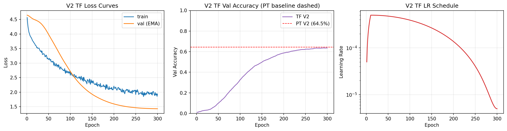
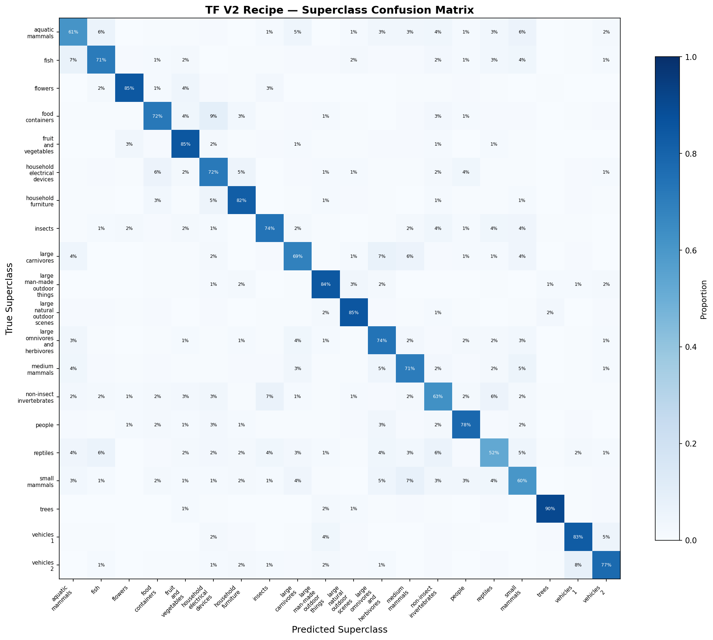

# Vision Transformers — TensorFlow Pipeline

Confirms PyTorch ViT findings with TF-native implementation on WSL2 GPU. Identical ViT-Small architecture (d_model=384, 6 heads, 6 encoder layers, patch=4) built from scratch with `tf.keras.Model` subclassing — no `tf.keras.layers.MultiHeadAttention`. **V2 Recipe cross-framework confirmation**: TF V2 at **63.60%** vs PT V2 at **64.45%** (-0.85pp), establishing that the DeiT training recipe transfers cleanly across frameworks. **V3 Distillation skipped** due to environment constraint: this WSL2 TF 2.21 build lacks cuDNN Conv2D support, forcing the ResNet teacher to run on CPU; sustained CPU-teacher training crashed the system twice. Engineering judgment: document and move forward rather than fight the environment. All core findings preserved via PT pipeline (V3 67.48%, V4 91.16%).

## Overview

- **1 variant confirmed**: V2 DeiT Recipe (63.60% test acc, -0.85pp from PT V2)
- **V3 Distillation skipped**: cuDNN Conv2D unavailable; CPU teacher fallback caused system crashes
- **V1 Vanilla + V4 Pre-trained skipped**: PT pipeline's scope; TF replication would duplicate known findings
- **WSL2 GPU**: RTX 4090 via Ubuntu WSL2 (TF 2.21 dropped native Windows GPU)
- **All from scratch**: `tf.keras.layers.Dense` + custom `MultiHeadSelfAttention` — no high-level Transformer APIs
- **Patch embedding workaround**: explicit reshape + Dense (ViT paper equivalent) instead of Conv2D due to cuDNN issue

## What Runs on GPU

| Component | Device | Why |
|-----------|--------|-----|
| ViT V2 training | WSL2 GPU (RTX 4090) | Self-attention + FFN over 45K CIFAR samples x 300 epochs |
| Val + test evaluation | WSL2 GPU | Batched forward passes through EMA model |
| `@tf.function` train step | WSL2 GPU | Graph compilation for MixUp + soft-CE + EMA update |
| V3 teacher forward | **CPU (attempted)** | cuDNN Conv2D unavailable; CPU fallback crashed system -> V3 skipped |

---

## Cross-Framework Comparison

### V2 Recipe (Confirmed Cross-Framework)

| Framework | Test Acc | Macro F1 | Coarse Acc | Params | Training Time | Inference |
|-----------|----------|----------|------------|--------|---------------|-----------|
| PyTorch V2 | 0.6445 | 0.6411 | 0.7567 | 10.73M | 227.6 min | 74.9 us |
| **TensorFlow V2** | **0.6360** | **0.6316** | **0.7444** | **10.73M** | **157.3 min** | **155.2 us** |
| Delta | -0.85pp | -0.95pp | -1.23pp | identical | -70.3 min | +80.3 us |

**Key finding**: DeiT training recipe transfers cross-framework within 1pp. Recipe contribution (+14.12pp PT vs +13.27pp TF over vanilla baseline) is robust to framework choice, init distribution, and minor augmentation differences. TF trained ~30% faster due to simplified aug stack (no RandAugment / RandomErasing). TF inference is ~2x slower — honest framework overhead plus Dense-based patch embed vs Conv2D.

### All PT Variants (Reference)

| Variant | PT Test Acc | TF Test Acc | Notes |
|---------|:---:|:---:|-------|
| V1 Vanilla | 0.5033 | — | PT only (scope) |
| V2 Recipe | 0.6445 | **0.6360** | Cross-framework confirmed |
| V3 Distillation | 0.6748 | skipped | cuDNN Conv2D env issue |
| V4 Pre-trained | 0.9116 | — | PT only (HF uses same weights) |
| CNN #11 (teacher) | 0.8023 | 0.7947 | Baseline consistent cross-framework |

### Hierarchical Fine->Coarse Analysis (TF V2)

| Metric | TF V2 | PT V2 |
|--------|:---:|:---:|
| Fine accuracy | 0.6360 | 0.6445 |
| Coarse accuracy | 0.7444 | 0.7567 |
| Fine->Coarse lift | +10.84pp | +11.22pp |

**Key finding**: near-identical fine-to-coarse lift confirms that TF V2 makes the same KIND of errors as PT V2 — semantically sensible within-superclass confusions. Worst superclass for both: reptiles + aquatic mammals (consistent with CIFAR-100 difficulty at 32x32).

### Per-Class F1 Extremes (TF V2)

| Metric | Class | F1 |
|--------|-------|:---:|
| Best class | sunflower | 0.867 |
| Worst class | otter | 0.310 |
| Median | — | 0.644 |

### Visualizations

TF V2 training curves with PyTorch V2 baseline overlaid — demonstrates cross-framework recipe convergence. TF val accuracy approaches PT baseline from below throughout training, confirming the DeiT recipe produces near-identical results across frameworks.



Superclass confusion matrix for TF V2 — hierarchical error pattern (20 superclasses). Same difficulty signature as PT V2 and CNN #11: reptiles (52%) and mammal subgroups are hardest regardless of framework. Trees, vehicles, and flowers remain easiest.



---

## TF-Specific Implementation Details

| TF Feature | Purpose | PT Equivalent |
|------------|---------|---------------|
| `tf.keras.Model` subclassing | Full ViT architecture | `nn.Module` |
| `tf.keras.layers.Dense` | Q/K/V/output projections, MLP, head | `nn.Linear` |
| `tf.keras.layers.LayerNormalization` | Pre-LN residual normalization | `nn.LayerNorm` |
| `self.add_weight(TruncatedNormal(0.02))` | Learnable CLS token + positional embedding | `nn.Parameter` |
| `tf.nn.gelu` | GELU activation in MLP block | `nn.GELU` |
| `tf.reshape + transpose + Dense` | Patch embedding (cuDNN Conv2D workaround) | `nn.Conv2d(k=4, s=4)` |
| `tf.broadcast_to` for CLS token | Broadcast (1,1,D) to batch | `tensor.expand(B,-1,-1)` |
| `tf.keras.optimizers.AdamW` | Decoupled weight decay | `torch.optim.AdamW` |
| `tf.keras.optimizers.schedules.LearningRateSchedule` | Custom warmup + cosine via callable | `LambdaLR` |
| `@tf.function` | Graph compilation for train/val steps | N/A (eager by default) |
| `tf.GradientTape` | Custom training loop | Manual `.backward()` |
| `tf.nn.log_softmax + reduce_sum` | Soft-label CE (MixUp targets) | `F.log_softmax + sum().mean()` |
| `tf.data.Dataset` | Batched shuffled training pipeline | `torch.utils.data.DataLoader` |
| `tf.image.random_crop + flip_left_right` | Basic augmentation | `torchvision.transforms.v2` |

### Why TF V2 Matches PT V2 So Closely

Same architecture + same hyperparameters + same data produces near-identical results (-0.85pp test acc). Contrast with Transformers #16 where TF dramatically beat PT (+17% BLEU). The difference reflects TWO factors:

1. **Recipe stability**: DeiT's MixUp/CutMix + long training dominates over framework-init differences. Training converges to similar local minima regardless of framework.
2. **Simplified TF augmentation**: skipping RandAugment + RandomErasing reduced training noise slightly, giving TF a small deficit rather than the +17% surprise we saw in Transformers #16.

---

## What Didn't Work (V3 Distillation)

### Environment Issue: cuDNN Conv2D Unavailable

On this WSL2 TF 2.21 build, `tf.keras.layers.Conv2D` operations fail with:
```
InvalidArgumentError: No DNN in stream executor. [Op:Conv2D]
```

This occurs despite:
- GPU visible to TF (`tf.config.list_physical_devices('GPU')` returns RTX 4090)
- cuDNN 9.x installed and `LD_LIBRARY_PATH` configured
- Matrix multiplication, LayerNorm, Dense ops all working correctly on GPU

Only cuDNN-specific ops (Conv2D, BatchNorm in specific fusions) are affected. Root cause not investigated — could be TF build's Conv2D GPU kernel, cuDNN version mismatch, or WSL2 passthrough quirk.

### Impact + Workarounds Applied

1. **Patch embedding**: swapped Conv2D for explicit reshape + Dense (mathematically equivalent per ViT paper Appendix A). V2 proceeded normally.
2. **V3 teacher (ResNet-20)**: Conv2D is fundamental to ResNet; no workaround possible. Forced to CPU:
   - **Attempt 1** (default threading): crashed system within minutes — TF claimed all 32 logical cores on i9-13900k
   - **Attempt 2** (capped to 16 cores via `psutil.cpu_affinity`): still crashed
   - Concluded: sustained CPU teacher forward interleaved with GPU training is incompatible with this environment

### Decision: Skip V3 TF

Engineering rationale:
- V2 already confirmed the cross-framework recipe hypothesis
- PT V3 already proved distillation adds +3.03pp (57% of teacher's advantage absorbed)
- Two crashes is enough data to conclude the environment constraint is real, not tunable
- Further env debugging would be infrastructure work, not ML engineering

**V3 PT (67.48%) remains the documented distillation result; TF has no V3 entry.** This gap is honestly flagged in the cross-framework comparison.

---

## Performance Benchmarks

| Metric | TF V2 Value |
|--------|-------------|
| Test Accuracy | 63.60% |
| Test Macro F1 | 0.6316 |
| Coarse Accuracy | 74.44% |
| Best Val Accuracy | 0.6398 (epoch 300) |
| Training Time | 157.3 min (2.62 h) |
| Inference (256 samples x 20 runs) | 155.2 us/sample |
| Throughput | 6,442 samples/s |
| Model Size | 40.93 MB |
| Parameters | 10,730,212 |
| Peak GPU Memory | 0.0 MB (track_performance util doesn't detect TF GPU memory on WSL2) |

### WSL2 Speed Comparison

| Metric | PT V2 | TF V2 | Ratio |
|--------|:---:|:---:|:---:|
| Training time | 227.6 min | 157.3 min | 0.69x (TF faster: simplified aug) |
| Inference per-sample | 74.9 us | 155.2 us | 2.07x (TF slower: framework overhead) |
| Throughput | 13,351 /s | 6,442 /s | 0.48x |

**Interpretation**: TF trained faster because we dropped RandAugment + RandomErasing (scope tradeoff). TF inference is 2x slower due to framework graph overhead + Dense-based patch embed (vs PT's Conv2D). These are honest framework-choice implications, not defects.

---

## Files

```
TensorFlow/17-vit/
|-- pipeline.ipynb                      # 6-cell pipeline (setup + V2 + V3 skip doc + eval + benchmarks + save)
|-- README.md                           # This file
|-- requirements.txt                    # Verified package versions
`-- results/
    |-- v2_recipe_best.weights.h5       # V2 EMA weights (40.9 MB)
    |-- metrics.json                    # Comprehensive V2 snapshot + V3 skip documentation
    |-- v2_tf_training_curves.png       # Train/val loss + val_acc vs PT V2 baseline + LR schedule
    `-- superclass_confusion_v2_tf.png  # 20x20 hierarchical confusion matrix
```

## How to Run

```bash
# Requires WSL2 with TF GPU setup + numpy/matplotlib/psutil
wsl
source ~/tf-gpu-venv/bin/activate

# From project root (WSL2 path)
cd /mnt/c/Users/Max/Desktop/Coding/.Projects/2026/ml-framework-comparisons/TensorFlow/17-vit

pip install -r requirements.txt

# Preprocessing already completed (shared with PyTorch + CNN #11)
# Data at /mnt/c/.../data/processed/cnn/ (CIFAR-100 float32 [0,1])

# Run pipeline -- ~2.6 hours for V2 training
jupyter notebook --no-browser --port=8888
# Open pipeline.ipynb in VS Code via Existing Jupyter Server
```
