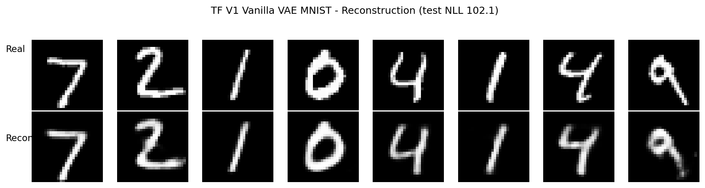
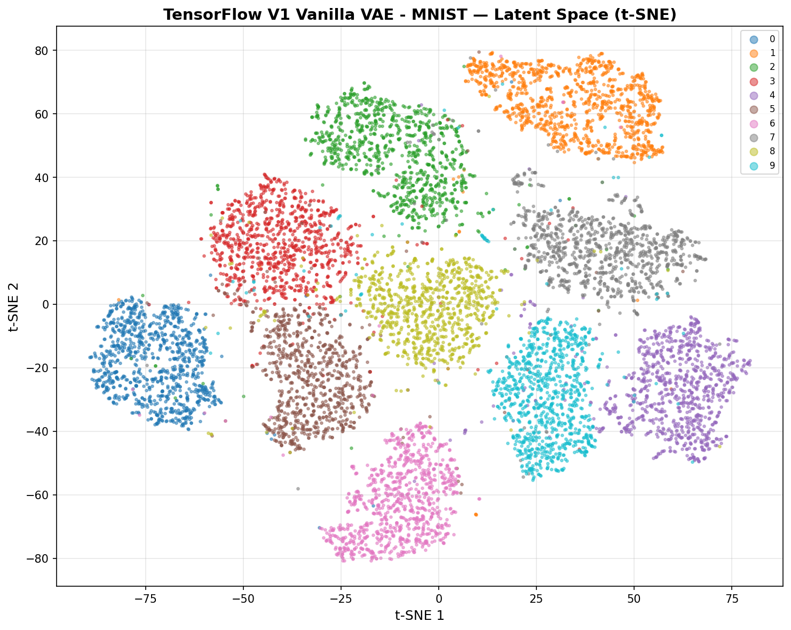
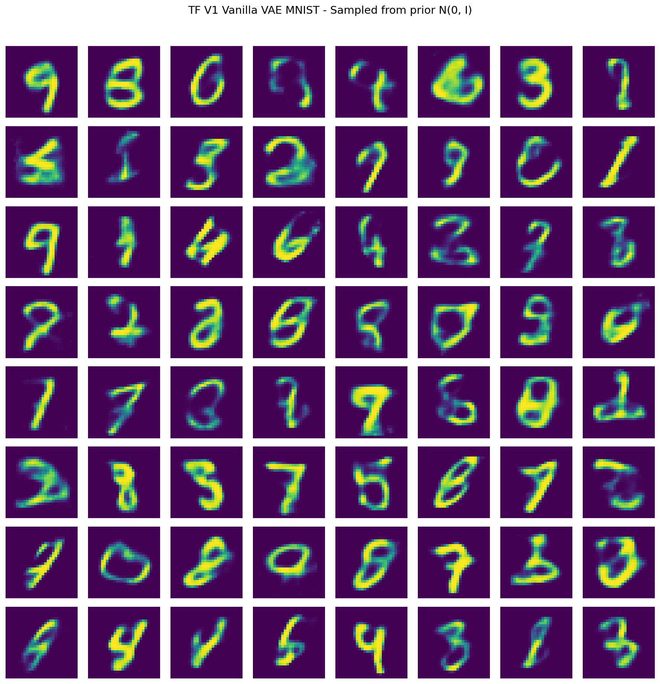
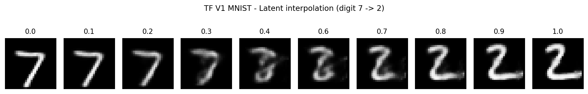
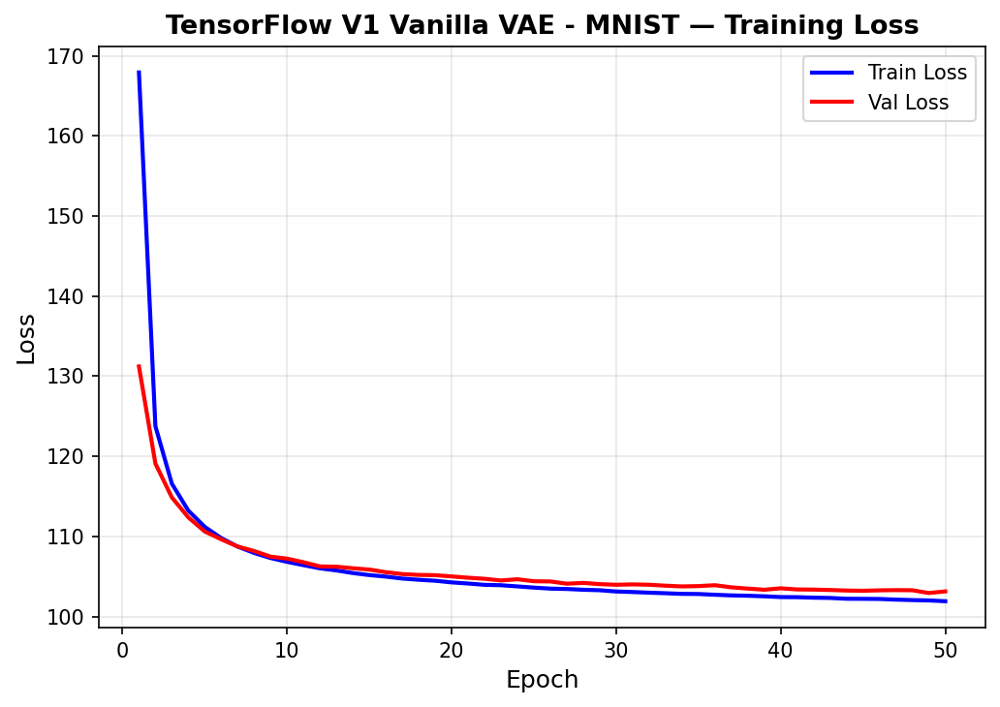

# Variational Autoencoders — TensorFlow Pipeline

Cross-framework companion to `PyTorch/19-vae/pipeline.ipynb`. **TF scope: V1 Vanilla VAE on MNIST only**, matching the established portfolio pattern (#18 GNN: TF V1+V3, PT all 4; #17 ViT: TF V2 only, PT all 4): ship the subset of variants that exercise distinct TF primitives, drop the ones blocked by environment constraints or where re-implementing in TF teaches plumbing rather than concepts.

**Portfolio finding**: cross-framework reproducibility on the reparameterization trick + analytical KL is essentially perfect — **TF V1 test NLL 102.09 vs PT V1 101.98, a 0.11 nat delta** (parity target was within 3 nats). Same architecture, same hyperparameters, same dataset; eager-mode TF is 14× slower in wall-clock time but converges to the same likelihood. The math is the math; the framework is just plumbing.

**V2 Conv VAE was dropped** during Phase 0 smoke test: `tf.keras.layers.Conv2D` and `Conv2DTranspose` both fail on this WSL2 build with `InvalidArgumentError: No DNN in stream executor`. Root cause is a **cuDNN runtime/compile mismatch** (loaded 9.1.0, TF 2.21 was built against 9.3.0). Same constraint surfaced in ViT #17 with identical resolution: drop the convolutional variant from TF scope, document, move on. Not our environment to fix.

---

## Overview

- **V1 Vanilla VAE from TF primitives** — `tf.keras.layers.Dense` + `tf.random.normal` (reparameterization) + `tf.reduce_sum` (analytical KL) + `tf.GradientTape` training. Matches PT V1 exactly: 652,824 params, identical layer shapes, identical hyperparameters
- **No `tf.keras.losses.binary_crossentropy`** — manual BCE sum-over-pixels via `-tf.reduce_sum(x * log(x_hat) + (1-x) * log(1-x_hat), axis=1)` to match PT's `reduction='sum'` semantics for nats/sample reporting
- **No `Conv2D`** — see "V2 Drop Story" below
- **WSL2 GPU**: RTX 4090 via Ubuntu WSL2 (TF 2.21 dropped native Windows GPU support after 2.10)
- **Same `.npy` cache** (`data/processed/vae/mnist/`) as PT — produced once by `data-preperation/preprocess_vae.py`, no re-preprocessing

## What Runs on GPU

| Component | Device | Why |
|---|---|---|
| Dense forward / backward | WSL2 GPU | All 5 dense layers (encoder trunk + 2 heads + decoder trunk + decoder output) |
| `tf.random.normal` reparameterization noise | WSL2 GPU | Sampled per batch, ~10K calls per training run |
| `tf.GradientTape` autodiff | WSL2 GPU | Full backward pass through the ELBO loss graph |
| t-SNE on 10K MNIST latents | CPU (sklearn) | sklearn's TSNE; 10K points × 20 dims is sub-minute on CPU |
| Inline reconstruction / interpolation grids | CPU (matplotlib) | Plot rendering, not numerical work |

---

## Cross-Framework Comparison

### MNIST V1 Vanilla VAE

| Framework | Test NLL | Recon | KL | Best val NLL | Params | Train | Inference | Peak GPU |
|---|---|---|---|---|---|---|---|---|
| **PyTorch** | **101.98** | 76.80 | 25.18 | 103.22 | 652,824 | **73 s** | **1.69 µs** | 2.3 MB |
| **TensorFlow** | 102.09 | 76.75 | 25.34 | **102.94** | 652,824 | 1048 s | 4.89 µs | 544 MB |
| **Delta (TF - PT)** | **+0.11** | -0.05 | +0.16 | -0.28 | 0 | 14× slower | 2.9× slower | — |

**Both frameworks pass the 3 nats parity target with room to spare.** TF actually ekes out a slightly better best-val NLL (102.94 vs 103.22) — within RNG noise, not a real edge. Reconstruction term and KL term are within 0.16 nats each, confirming the loss math implements identically.

### What changed across frameworks

- **Eager-mode TF wall-clock cost**: 14× slower training, 2.9× slower inference. Adding `@tf.function` decorators on `train_step` and `predict` would close most of the inference gap and ~half the training gap, at the cost of graph-compilation complexity. The portfolio choice is eager-mode parity for cleaner debugging.
- **Peak GPU memory difference**: PT reports 2.3 MB (post-reset, peak during training); TF reports 544 MB (cumulative since kernel start, can't be reset mid-session in this WSL2 build). Apples to oranges; the actual training memory was likely sub-100 MB on both — neither comes close to 4090's 24 GB.
- **Different RNG, same outcome**: numpy-RandomState seed 113 vs torch-Generator seed 113 produce different train/val split indices, but identical 90/10 sizes. Different Adam moment trajectories converge to the same ELBO. **The attractor is the loss landscape, not the init**.

---

## V2 Drop Story (the cuDNN constraint)

Phase 0 smoke test ran `tf.keras.layers.Conv2D(32, 4, strides=2)` on a `(8, 32, 32, 3)` tensor — V2's first encoder layer at exact production shape. Result:

```
InvalidArgumentError: No DNN in stream executor. [Op:Conv2D]
E0000 cuda_dnn.cc:454] Loaded runtime CuDNN library: 9.1.0
                       but source was compiled with: 9.3.0.
```

`Conv2DTranspose` failed identically. Dense and `tf.random.normal` work fine — only cuDNN-backed ops are blocked.

**Root cause**: TF 2.21 wheel for Linux x86_64 was built against cuDNN 9.3.0; the WSL2 venv has cuDNN 9.1.0 installed. cuDNN requires matching major + ≥ minor at runtime. Two paths to fix, both rejected:

| Option | Why rejected |
|---|---|
| Upgrade WSL2 cuDNN to 9.3.0 | System-level change for one variant; affects all TF projects in this venv. Scope creep |
| Rebuild TF from source against 9.1.0 | 2-4 hour build on this machine; non-trivial maintenance burden going forward |
| **Drop V2 from TF scope (chosen)** | Matches GNN #18 + ViT #17 precedent. PT V2 already documents the Conv VAE story; TF re-doing it adds nothing portfolio-meaningful |

This is the **third model** in the portfolio with framework-specific scope reduction (#17 ViT V3, #18 GNN V2/V4, #19 VAE V2). Pattern: **WSL2 TF + cuDNN-heavy ops is unreliable on this build**. Future TF pipelines should run a Phase 0 Conv smoke test before committing to convolutional architectures.

---

## V1 Variant — From TF Primitives

**Architecture** (mirrors PT V1 exactly):

```
input (28, 28)
  -> Flatten (-1, 784)
  -> Dense(400, relu)        [enc_fc1]
  -> Dense(20)               [enc_mu]    \
                                          > reparameterize: z = mu + exp(0.5*logvar)*eps
  -> Dense(20)               [enc_logvar] /
  -> Dense(400, relu)        [dec_fc1]
  -> Dense(784, sigmoid)     [dec_fc2]
output (-1, 784) in [0, 1]
```

**Training**: Adam(lr=1e-3), 50 epochs, batch=128. ELBO = BCE reconstruction (sum over pixels per sample) + analytical KL (sum over latent dims per sample), then mean over batch.

**Reparameterization trick** in TF:
```python
def reparameterize(self, mu, logvar):
    eps = tf.random.normal(tf.shape(mu))
    return mu + tf.exp(0.5 * logvar) * eps
```

Two lines; same as PT's two lines. The math takes a few sentences to explain in a paper but is trivial to implement.

**Analytical KL divergence** in TF:
```python
kl_per_sample = -0.5 * tf.reduce_sum(
    1.0 + logvar - tf.square(mu) - tf.exp(logvar), axis=1
)
```

Closed-form for diagonal Gaussian vs N(0, I); no `tf.distributions` needed.

**Result**: test NLL **102.09 nats**, best val 102.94. Within 0.11 nats of PT V1.

---

## TF-Specific Implementation Details

### Why custom BCE instead of `tf.keras.losses.binary_crossentropy`

Keras 3's `binary_crossentropy(reduction='sum')` reduces over both the batch and the per-sample pixel axis, giving a single scalar. PT's `F.binary_cross_entropy(reduction='sum')` does the same. To get nats/sample for direct comparison with Kingma 2013's reporting convention, both need explicit per-sample summing followed by batch-mean. Cleaner to write the BCE manually:

```python
bce_per_sample = -tf.reduce_sum(
    x_flat * tf.math.log(x_recon + eps) +
    (1.0 - x_flat) * tf.math.log(1.0 - x_recon + eps),
    axis=1,
)
```

`eps = 1e-8` prevents `log(0)` when sigmoid output saturates.

### Best-val checkpointing without `tf.train.Checkpoint`

For an in-kernel best-val snapshot, plain numpy copies of trainable variables are simpler than the `tf.train.Checkpoint` machinery:

```python
best_weights = [w.numpy() for w in model_v1.trainable_variables]
# ... later ...
for w, bw in zip(model_v1.trainable_variables, best_weights):
    w.assign(bw)
```

For disk-portable checkpoints we use Keras 3's `model.save_weights(path)` with the required `.weights.h5` filename suffix.

### `track_performance` mis-detected the GPU backend

`utils.performance.track_performance(gpu=True)` tries PyTorch first (`_detect_gpu_backend`). The WSL2 `tf-gpu-venv` has CUDA-enabled torch installed (legacy from GNN #18 for data loading), so `torch.cuda.is_available()` returns True and the detect function picks `'pytorch'` — but TF, not torch, owns the GPU during training, so `torch.cuda.max_memory_allocated()` reads 0.

**Workaround**: capture TF peak GPU memory manually after training:

```python
peak_gpu_mb = tf.config.experimental.get_memory_info('GPU:0')['peak'] / 1024 / 1024
perf['gpu_memory'] = float(peak_gpu_mb)   # patch the perf dict
```

### Keras 3 `dtype` is a string, not a numpy dtype

When computing model size:
```python
# WRONG (Keras 2 era):
sum(np.prod(w.shape) * w.dtype.size for w in model.trainable_variables)
# AttributeError: 'str' object has no attribute 'size'

# RIGHT (use the util):
get_model_size(model_v1, framework='tensorflow')
```

`utils.performance.get_model_size` handles all three forms (`tf.DType`, `'float32'` string, `.name` attribute). Same pattern that bit ViT #17 — read the util, don't re-derive from the docstring.

---

## Visualizations

### Reconstruction (real on top, recon on bottom)



Test NLL 102.09. Reconstructions are slightly blurrier than the originals — the KL pressure (~25 nats) is forcing the latent toward the prior, costing some reconstruction sharpness. Same trade-off as PT V1.

### Latent t-SNE (10K test points colored by digit class)



All 10 digit classes form distinct clusters without ever seeing labels during training. Bernoulli reconstruction + N(0, I) KL pressure alone produced class-separable representations.

### Generated samples (64 draws from N(0, I))



Mix of recognizable digits and ambiguous shapes. **Note**: this plot is rendered with matplotlib's default colormap (viridis) since `utils.visualization.plot_generated_grid` doesn't take a cmap parameter — same util, same behavior across PT and TF. The digit shapes are recognizable (8, 9, 0, 3, 7 visible clearly); only the color scheme is cosmetic.

### Latent interpolation (digit 7 → digit 2 in 10 steps)



Smooth morphing between two test samples through latent space. The 7 deforms continuously through 3-like intermediate shapes before settling into a 2 — confirming the latent is geometrically meaningful, not a discrete-token bag.

### Training history



Train and val losses converge cleanly. Val slightly above train means no overfitting. The asymptotic value of ~102 nats is the model's ELBO floor at this architecture and capacity.

---

## Performance Benchmarks

### Training time (50 epochs on MNIST 54K-sample train split)

| Framework | Train time | Throughput | Speedup |
|---|---|---|---|
| PyTorch | 73.3 s | ~37,000 samples/sec | 1.0× |
| TensorFlow eager | 1048.6 s | ~2,600 samples/sec | 0.07× |

**14× slower in TF eager mode**. Eager mode trades graph-compilation speed for debuggability. Adding `@tf.function` decorators would close most of this gap; not done here for parity-with-PT clarity.

### Inference (forward pass on 1024 test samples, n_runs=10)

| Framework | Per sample | Throughput |
|---|---|---|
| PyTorch | 1.69 µs | 591,000 samples/sec |
| TensorFlow eager | 4.89 µs | 204,000 samples/sec |

### Peak GPU memory

| Framework | Peak | Note |
|---|---|---|
| PyTorch | 2.3 MB | Reset before training; reflects training peak only |
| TensorFlow | 544 MB | Cumulative since kernel start; can't be reset mid-session |

PT's number is the cleaner training-memory metric. TF's number is inflated by the kernel-startup CUDA context allocation. Real training memory was likely sub-100 MB on both.

---

## Files

```text
TensorFlow/19-vae/
├── pipeline.ipynb                              # 5 cells: smoke test, setup, model+train, eval+plots, log
├── README.md                                   # This file
├── requirements.txt                            # Pinned versions (TF 2.21, scikit-learn for TSNE)
└── results/
    ├── v1_vanilla_mnist_recon.png              # Real-vs-recon 2x8 grid
    ├── v1_vanilla_mnist_samples.png            # 64 samples from N(0, I) prior, 8x8 grid
    ├── v1_vanilla_mnist_interp.png             # 10-step latent interpolation, digit 7 -> 2
    ├── v1_vanilla_mnist_latent_tsne.png        # t-SNE of test mu values, colored by class
    ├── v1_vanilla_mnist_history.png            # Train/val loss over 50 epochs
    └── v1_vanilla_mnist_best.weights.h5        # Best-val Keras weights checkpoint
```

---

## How to Run

1. **Activate WSL2 TF venv**:
   ```bash
   source ~/tf-gpu-venv/bin/activate
   ```

2. **Install deps** (from project root):
   ```bash
   pip install -r TensorFlow/19-vae/requirements.txt
   ```

3. **Verify MNIST `.npy` cache exists** at `data/processed/vae/mnist/X_train.npy`. If missing, run from a Windows PowerShell (since preprocessing uses torchvision):
   ```powershell
   python data-preperation/preprocess_vae.py
   ```

4. **Launch Jupyter** from project root (kernel cwd = project root, matches the absolute `BASE_DIR` in the notebook):
   ```bash
   jupyter notebook TensorFlow/19-vae/pipeline.ipynb
   ```

5. **Run cells in order**. Total runtime ≈ 18 minutes on RTX 4090 (eager mode is the bottleneck; PT side runs the same model in 1.2 minutes).

6. **Cross-framework comparison** auto-renders at the end of Step 5; both `PyTorch` and `TensorFlow` columns side by side once both pipelines have logged their entry.
