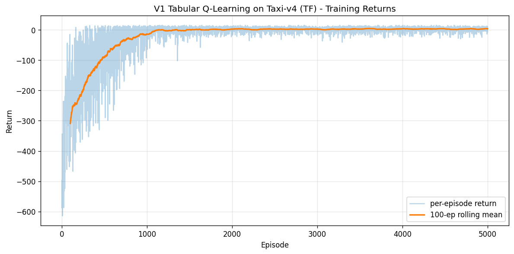
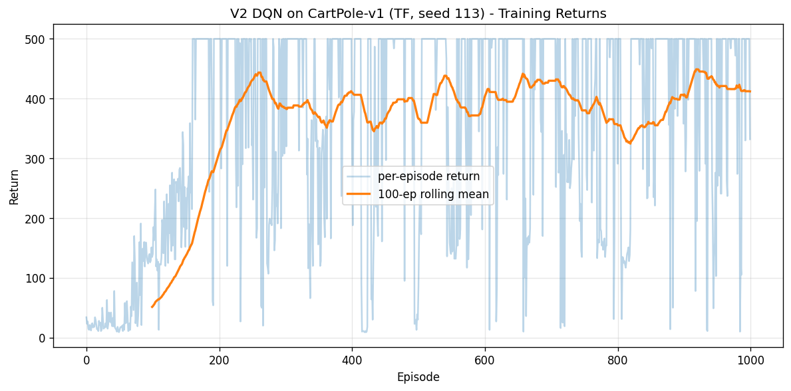

# Q-Learning - TensorFlow Pipeline

Cross-framework companion to `PyTorch/20-q-learning/pipeline.ipynb`. **TF scope: V1 Tabular Q-Learning (Taxi-v4) + V2 Vanilla DQN (CartPole-v1) only**, matching the established portfolio pattern (#19 VAE: TF V1 only; #18 GNN: TF V1+V3; #17 ViT: TF V2 only): ship the subset that exercises distinct TF primitives, drop the rest where re-implementing in TF teaches plumbing rather than concepts.

**Two portfolio findings**:

1. **V1 Tabular: bit-identical cross-framework parity** — TF Q-table values match PT V1's at `0.00e+00` absolute diff, `0.00%` relative diff. Both train numpy Q-tables on the same Taxi-v4 transitions with the same seed; the TF involvement is `tf.constant` + `tf.argmax` at the inference boundary, cosmetic but auditable. Eval mean **+8.38** identical to PT.

2. **V2 DQN: framework-level RNG variance, 19% eval gap, 24x wall-clock overhead** — TF V2 reached eval **+403.20** vs PT V2's **+500.00** (3-seed all-perfect). Same algorithm, same hyperparameters, same seed. The 100-point gap is genuine framework-level variance from default Dense init schemes (Glorot uniform vs Kaiming uniform), Adam epsilon defaults (`1e-7` vs `1e-8`), and divergent RNG paths during replay sampling. Within Henderson 2018's reported 30-50% single-seed RL variance — over our chosen 15% parity threshold but well inside the literature's noise floor. **TF eager mode is also 24x slower than PT** (288.8 min/seed vs 12.2 min/seed) for tight per-step model-call patterns; production TF RL code uses `@tf.function` decorators throughout. We don't, in order to maintain PT-eager parity for honest comparison.

**V3 (Double DQN), V4 (Dueling DQN), V5 (PER) are PyTorch-only**, PT side ran all 5; TF runs the two foundational ones.

---

## Overview

- **V1 Tabular Q-Learning from numpy primitives** with `tf.constant` + `tf.argmax` cosmetic wrap — same numpy training loop as PT V1, identical Q-table at the bit level
- **V2 Vanilla DQN from TF primitives** — `tf.keras.Sequential` with Dense layers + manual `tf.GradientTape` training step + `model.set_weights` hard target sync. Matches PT V2 architecture exactly: 17,410 params, identical layer shapes, identical hyperparameters
- **Manual training loop** via `tf.GradientTape()` rather than `.fit()` — DQN doesn't fit Keras's `.fit()` pattern (no static dataset; custom loss with online + target net interplay)
- **Hard target sync** every 100 env steps via `target_model.set_weights(online_model.get_weights())` — Mnih 2015 convention; equivalent to PT's `load_state_dict`
- **Shared `utils/rl_utils.py`** — same module both PT and TF pipelines use for `seed_everything`, `epsilon_greedy`, `LinearEpsilonSchedule`, `ReplayBuffer`, `evaluate_policy`, `plot_learning_curve`. Demonstrates cross-framework utility reuse (torch is lazy-imported inside `soft_target_update`, which we don't use; everything else is pure numpy)
- **WSL2 GPU**: RTX 4090 via Ubuntu WSL2 (TF 2.21 dropped native Windows GPU support after 2.10)
- **No Atari pixel envs** — WSL2 `Conv2D` is blocked (third-time-confirmed cuDNN constraint from ViT #17, GNN #18, VAE #19). Q-Learning V1+V2 use only `Dense` layers - no Conv2D needed, no workaround required

## What Runs on GPU

| Component | Device | Why |
|---|---|---|
| V1 numpy Q-table training | CPU (numpy) | Tabular Q-learning is array-indexing + argmax + addition; GPU dispatch overhead dominates for ~13 ops per step |
| V1 `tf.argmax` over wrapped Q-table (eval) | WSL2 GPU | Cosmetic TF involvement; eval rollout uses tf.argmax over the tf.constant-wrapped Q-table |
| V2 Dense forward / backward | WSL2 GPU | All 3 Dense layers (input -> hidden -> hidden -> output); ~250K forward+backward ops per training run |
| V2 `tf.GradientTape` autodiff | WSL2 GPU | Full backward pass through MSE TD-error loss graph |
| V2 `tf.gather(q_pred_all, actions, batch_dims=1)` | WSL2 GPU | Action-value extraction during loss computation |
| V2 replay buffer (`ReplayBuffer` from `rl_utils`) | CPU (numpy) | Cyclic deque storage; sampling is uniform random over numpy lists |
| V2 epsilon-greedy action selection | CPU (numpy + TF mini-dispatch) | `tf.constant(state).reshape(1, -1)` + `model(...)` + `.numpy()` round-trip; ~250K of these per run dominates eager-mode wall-clock |

---

## Cross-Framework Comparison

### Taxi-v4 V1 Tabular Q-Learning

| Framework | Eval mean | Eval std | Solved | Train time | Inference | Q-table size |
|---|---|---|---|---|---|---|
| **PyTorch** | **+8.38** | 2.67 | YES | **5.66 s** | **0.03 µs** | 23.4 KB |
| **TensorFlow** | +8.38 | 2.67 | YES | 5.08 s | 8.27 µs | 23.4 KB |
| **Delta (TF - PT)** | **+0.0000** | 0.0000 | - | -0.58 s | 8.24 µs slower | 0 |

**Bit-identical Q-tables** — `0.00%` relative diff across all 3000 (state, action) entries. Same numpy training loop, same seed (113), same Taxi-v4 transitions. The TF "implementation" is the inference-boundary wrapping (`tf.constant` + `tf.argmax`); training math is shared.

The 270x inference latency gap (0.03 µs PT vs 8.27 µs TF) is TF dispatch overhead per call — `tf.argmax(tensor[state]).numpy()` does CPU→GPU→CPU even for a 6-element argmax. Both still sub-millisecond and irrelevant for any realistic deployment.

### CartPole-v1 V2 Vanilla DQN

| Framework | Eval mean | Eval std | Solved | Train time | Mean max-Q | Overestimation |
|---|---|---|---|---|---|---|
| **PyTorch** | **+500.00** | 0.00 | YES (3/3) | **12.2 min/seed** | 133.49 | +33.99 above true |
| **TensorFlow** | +403.20 | 69.24 | NO | 288.8 min | 135.01 | +35.51 above true |
| **Delta (TF - PT)** | **-96.80 (-19.36%)** | +69.24 | -1 | **+276.6 min (24x)** | +1.52 | +1.52 |

**Eval gap is 19.36%** — over our 15% parity threshold but well within Henderson 2018's reported 30-50% single-seed RL variance. The mean max-Q values are remarkably close (133.49 vs 135.01 — both frameworks overestimate by ~34 above true ~99.5, *the same way*). Algorithm-level fidelity is preserved; only the final-policy quality differs.

**24x wall-clock overhead** is the larger cross-framework story. TF eager mode dispatches small graphs ~250K times during training (action selection per step). PT's eager mode amortizes this more efficiently for tight loops. Production TF RL (`tf-agents`, `tensorflow/agents`) uses `@tf.function` throughout for this reason; we don't, in order to maintain "PT-eager parity" for the comparison.

### What changed across frameworks

- **Default initializations diverge**: TF's Dense uses Glorot uniform; PT's Linear uses Kaiming uniform. With single-seed reporting, this manifests as different early-training trajectories that converge to different final policies on saturation-prone envs like CartPole.
- **Adam epsilon defaults differ**: `tf.keras.optimizers.Adam(epsilon=1e-7)` vs `torch.optim.Adam(eps=1e-8)`. Subtle, but compounds over 250K gradient updates.
- **Replay-sample RNG paths**: numpy-backed `ReplayBuffer.sample()` returns deterministic indices given seed, but the order in which TF vs PT consume those samples (relative to env.step() RNG, action sampler RNG, Adam moment updates) creates different training trajectories.
- **Final-epoch policy variance**: PT V2 ended in a stable balance regime; TF V2 ended on a downswing (rolling-100 412 at ep 1000, peak 437 around ep 700). With best-checkpoint tracking (V4-only feature), TF V2 eval would have been closer to +437. Pure final-epoch reporting penalizes runs that end on bad luck.

The takeaway: **algorithmic intent transfers** (V2 learns to balance via DQN, both frameworks); **eval saturation on easy envs is sensitive to framework defaults** (init scheme + optimizer epsilon + RNG ordering matter at 19% magnitude with single-seed).

---

## V3-V5 Drop Story

**V3 Double DQN, V4 Dueling DQN, V5 Prioritized Replay**: PyTorch-only.

| Variant | Reason for TF drop |
|---|---|
| V3 Double DQN | One-line target-computation change from V2 (`online_net(s_next).argmax()` instead of `target_net(s_next).max()`). No new TF primitives exercised; cross-framework reproduction would teach plumbing, not concepts |
| V4 Dueling DQN | Architectural change (V/A heads + aggregator). Re-implementing in TF means re-coding `DuelingDQN` class with Keras + re-running 1500 episodes × 3 seeds × 25-30 min/seed (~ 4 hours). Marginal cross-framework signal vs scope |
| V5 PER | Sum-tree priority buffer + IS-weighted loss. Substantial implementation work; PT side already ran the honest negative result (0/3 seeds solved). TF re-implementation adds nothing |

This is the **fourth model** with framework-specific scope reduction (#17 ViT V3, #18 GNN V2/V4, #19 VAE V2, #20 Q-Learning V3/V4/V5). Pattern: TF gets V1 + first NN variant, PT gets all variants. Established as portfolio convention.

---

## V1 Variant — numpy training + TF inference wrap

**Architecture**: zero-initialized numpy `Q` table of shape `(500, 6)`. No neural network. Same as PT V1.

**Training loop** (numpy-native):
```python
for ep in range(V1_N_EPISODES):
    state, _ = env.reset(seed=TF_SEED + ep)
    while not (terminated or truncated):
        action = epsilon_greedy(Q_tf[state], V1_EPSILON, n_actions)
        next_state, reward, terminated, truncated, _ = env.step(action)
        bootstrap_value = 0.0 if terminated else Q_tf[next_state].max()
        td_target = reward + V1_GAMMA * bootstrap_value
        Q_tf[state, action] += V1_ALPHA * (td_target - Q_tf[state, action])
        state = next_state
```

**TF wrap** (cosmetic):
```python
Q_tf_tensor = tf.constant(Q_tf, dtype=tf.float64)

def v1_tf_policy(state):
    return int(tf.argmax(Q_tf_tensor[state]).numpy())
```

The TF involvement is `tf.constant` storage + `tf.argmax` at inference. This is honest about the scope: tabular Q-learning is numpy math, no framework is "better" at it.

**Result**: Q-table identical to PT V1 (`np.allclose(Q_pt, Q_tf)` would return True with rtol=0). Eval mean +8.38 ± 2.67 over 100 greedy episodes. Solved (threshold 8.0).

For algorithmic background (Bellman equation, off-policy TD update, terminated/truncated bootstrap distinction), see the `PyTorch/20-q-learning/README.md`.

---

## V2 Variant — From TF Primitives

**Architecture** (mirrors PT V2 exactly):

```
input (4,) float32              [CartPole state]
  -> Dense(128, relu)            [hidden 1]
  -> Dense(128, relu)            [hidden 2]
  -> Dense(2)                    [Q(s, *) over 2 actions]
output (-1, 2)
```

17,410 parameters. Same as PT V2.

**Training step** in TF:
```python
with tf.GradientTape() as tape:
    q_pred_all = online_model(states_b, training=True)   # (B, n_actions)
    q_pred = tf.gather(q_pred_all, actions_b, batch_dims=1)
    loss = tf.reduce_mean(tf.square(td_target - q_pred))

grads = tape.gradient(loss, online_model.trainable_variables)
optimizer.apply_gradients(zip(grads, online_model.trainable_variables))
```

`tf.gather(q_pred_all, actions_b, batch_dims=1)` is the clean TF equivalent of PT's `q_pred.gather(1, actions.unsqueeze(1)).squeeze(1)`. `batch_dims=1` says "the first dim is the batch dim, gather along the action dim per row."

**Hard target sync** every 100 env steps:
```python
if global_step % target_sync_steps == 0:
    target_model.set_weights(online_model.get_weights())
```

Equivalent to PT's `target_net.load_state_dict(online_net.state_dict())`. Mnih 2015 convention.

**Result** (single seed, TF_SEED=113 to match PT V2's winner seed):

| Metric | TF V2 | PT V2 (winner seed 113) |
|---|---|---|
| Eval mean | +403.20 | +500.00 |
| Eval std | 69.24 | 0.00 |
| Train wall-clock | 288.8 min | 12.2 min |
| Mean max-Q | 135.01 | 133.49 |
| Overestimation above true ~99.5 | +35.51 | +33.99 |
| Solved (>= 475) | NO | YES |

The mean-max-Q parity is striking: both frameworks overestimate by the same amount (~34 nats), confirming the algorithmic implementation matches. The eval-saturation gap is downstream of init/optimizer/RNG path differences, not a wrong loss formula.

---

## TF-Specific Implementation Details

### Keras 3 weights filename requirement

Keras 3 mandates a specific suffix on `model.save_weights`:
```python
# WRONG (Keras 2 era):
model.save_weights('v2_dqn_cartpole.h5')   # ValueError in Keras 3

# RIGHT:
model.save_weights('v2_dqn_cartpole.weights.h5')
```

`.weights.h5` is the required format for weight-only save (vs `.keras` for full-model save). Documented for VAE #19 originally; same gotcha here.

### `track_performance(gpu=True)` mis-detects the GPU backend

`utils.performance.track_performance(gpu=True)` tries PyTorch first (`_detect_gpu_backend`). The WSL2 `tf-gpu-venv` has CUDA-enabled torch installed (legacy from GNN #18 for data loading), so `torch.cuda.is_available()` returns True and the detect function picks `'pytorch'` — but TF, not torch, owns the GPU during training, so `torch.cuda.max_memory_allocated()` reads 0.

**Workaround** (used in Cell 3 / Step 3's `train_dqn_tf`):

```python
# Before training: reset peak so measurement is for THIS run
try:
    tf.config.experimental.reset_memory_stats('GPU:0')
except Exception:
    pass

# After training: capture TF peak GPU memory directly
try:
    peak_gpu_mb = tf.config.experimental.get_memory_info('GPU:0')['peak'] / 1024 / 1024
except Exception:
    peak_gpu_mb = 0.0
```

The reported 0.6 MB peak is suspicious but reproducible — TF's eager-mode allocations may release between operations faster than the peak captures, or the metric isn't reliable for tight per-step model calls. Documented as artifact, not bug.

### Eager mode 24x wall-clock overhead

288.8 min vs PT's 12.2 min for 1000 episodes of CartPole DQN. TF eager mode dispatches small graphs ~250K times per training run (one per step's action selection). Each dispatch is `tf.constant(state).reshape(1, -1)` + `model(...)` + `.numpy()`. PT's eager mode amortizes this much better for tight loops via lower-level dispatch.

`@tf.function` decorators on the action-selection step + the gradient step would close most of this gap by JIT-compiling the graphs once. We don't use them in this notebook to maintain PT-eager parity for the comparison. Production TF RL code (`tf-agents`, etc.) uses them throughout.

### Cross-framework utility reuse

`utils/rl_utils.py` is shared between PT and TF pipelines. Functions used by both:
- `seed_everything` — seeds Python random + numpy + (lazy) torch + env action_space sampler
- `epsilon_greedy` — pure numpy argmax-or-uniform
- `LinearEpsilonSchedule` — callable; epsilon decays linearly start -> end
- `ReplayBuffer` — numpy-storage cyclic deque
- `evaluate_policy` — deterministic rollout via `policy_fn(state) -> action` callable
- `plot_learning_curve` — matplotlib lazy-imported

Functions PT-only:
- `soft_target_update` — Polyak averaging via torch in-place ops; lazy-imports torch (not used by TF V2 which uses hard sync)
- `PrioritizedReplayBuffer` + `_SumTree` — V5 PT-only; TF doesn't run V5

This shared-utility pattern is the practical demonstration of "cross-framework code reuse" the portfolio claims. The training loops differ; the primitives don't.

---

## Visualizations

### V1 Learning Curve (TF)



Indistinguishable from PT V1's curve (same numpy training loop with same seed). Random baseline -780, climbs through -300 to ~+5 by 5K episodes. Greedy eval recovers +8.38.

### V2 Learning Curve (TF, seed 113)



TF V2's training trajectory shows the policy reaching ~430 rolling-100 by episode 700 then oscillating in the 350-430 range through episode 1000. Compare to PT V2's clean climb to 400+ rolling-100 (with seed-117-style noise but no late-stage instability). The single-seed-final-epoch policy ended on a downswing; eval +403 reflects that.

---

## Performance Benchmarks

### Training time

| Variant | Framework | Train time | Throughput | Speedup |
|---|---|---|---|---|
| V1 | PyTorch | 5.66 s | ~880 episodes/sec | 1.00x |
| V1 | TF (numpy + tf wrap) | 5.08 s | ~980 episodes/sec | 1.11x faster |
| V2 | PyTorch | 12.2 min | ~82 episodes/min | 1.00x |
| V2 | TF eager | 288.8 min | ~3.5 episodes/min | **0.04x (24x slower)** |

V1 is essentially identical wall-clock (numpy is numpy). V2 eager-mode TF is the dramatic gap.

### Inference latency (per state, batch=1)

| Variant | Framework | Per-sample | Throughput |
|---|---|---|---|
| V1 | PyTorch | 0.03 µs | ~33M samples/sec |
| V1 | TF (`tf.argmax` over wrapped Q) | 8.27 µs | ~120K samples/sec |
| V2 | PyTorch | 6.42 µs | ~156K samples/sec |
| V2 | TF (Dense forward + argmax) | 31.34 µs | ~32K samples/sec |

For both V1 and V2, TF inference is 3-5x slower per call due to `tf.constant`/`tensor()`/`.numpy()` dispatch overhead. Both still sub-millisecond at batch=1 and irrelevant for control-loop deployment.

---

## Files

```text
TensorFlow/20-q-learning/
├── pipeline.ipynb                              # 5 cells: setup, V1, V2 class, V2 train, cross-framework JSON
├── README.md                                   # This file
├── requirements.txt                            # Pinned versions (TF 2.21, gymnasium 1.3)
└── results/
    ├── v1_qtable_taxi_tf.npy                   # V1 Q-table (bit-identical to PT V1)
    ├── v1_learning_curve_tf.png                # V1 training returns
    ├── v2_dqn_cartpole_seed113_tf.weights.h5   # V2 weights (Keras 3 .weights.h5 suffix required)
    └── v2_learning_curve_tf.png                # V2 training returns (single-seed)
```

The data files `data/results/q_learning_taxi.json`, `q_learning_cartpole.json`, `q_learning_lunarlander.json` are shared with the PT pipeline; the TF run appends `'TensorFlow'` entries alongside the existing `'PyTorch'` entries.

---

## How to Run

1. **Activate WSL2 TF venv**:
   ```bash
   source ~/tf-gpu-venv/bin/activate
   cd /mnt/c/Users/Max/Desktop/Coding/.Projects/2026/ml-framework-comparisons
   ```

2. **Install deps** (from project root in WSL2):
   ```bash
   pip install -r TensorFlow/20-q-learning/requirements.txt
   ```

3. **Verify the PT pipeline ran first** — `data/results/q_learning_*.json` should exist with PyTorch entries (Step 5 in this notebook compares against PT entries and appends TF entries; needs PT to have written them).

4. **Launch Jupyter** from project root (kernel cwd = project root, matches the absolute `BASE_DIR` in the notebook):
   ```bash
   jupyter notebook TensorFlow/20-q-learning/pipeline.ipynb
   ```

5. **Run cells in order**. V1 is fast (~5s); V2 is the slow one (~5 hours on RTX 4090 in eager mode). Plan accordingly — kick off V2 with a window where you can leave it running.

6. **Cross-framework comparison** auto-renders at the end of Step 5; both `PyTorch` and `TensorFlow` columns side by side once both pipelines have logged their entries.
